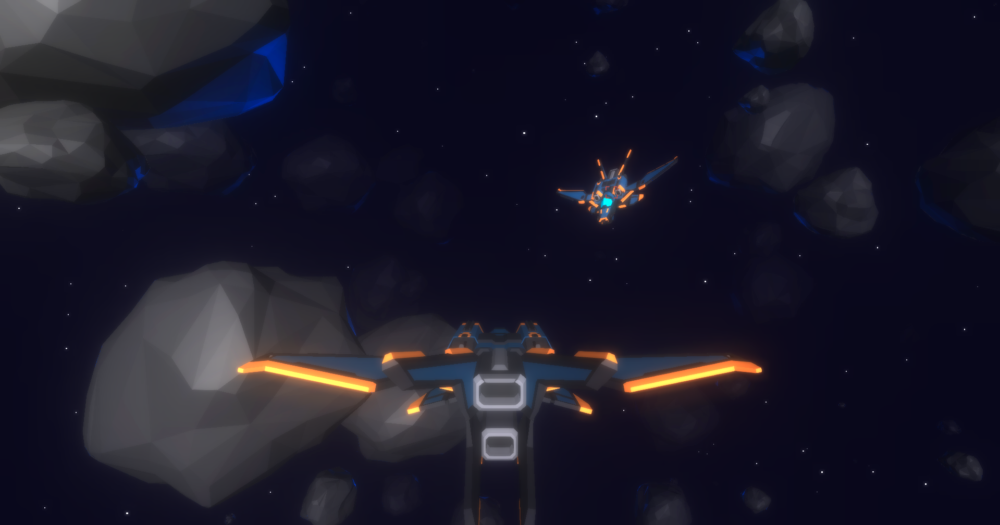

# [3D Multiplayer Browser Shooter](https://urk-void.onrender.com/)

A 3D multiplayer space dogfight game made with three.js and ws.



## Getting Started

These instructions will get you a copy of the project up and running on your local machine for development and testing purposes.

### Prerequisites

* [Git](https://git-scm.com/book/en/v2/Getting-Started-Installing-Git)
* [Node.js](https://nodejs.org/en/download/package-manager/)
* [npm](https://www.npmjs.com/get-npm)

### Installing

Clone Git repository

```
git clone https://github.com/nickyvanurk/3d-multiplayer-browser-shooter.git
```

Install required npm modules

```
npm install
```

Start the game server

```
npm run server:start:dev
```

Start the web server

```
npm run client:start:dev
```

Surf to localhost:8080!

## License

This project is licensed under the [MIT License](./LICENSE).
