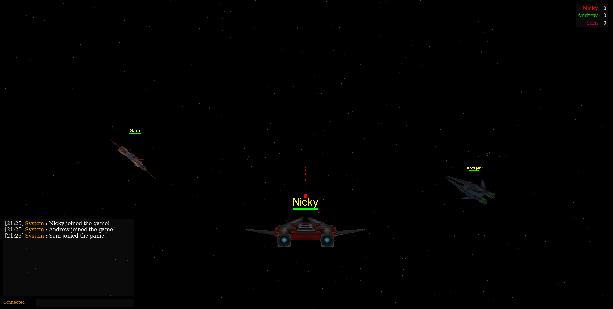

# [3D Multiplayer Browser Shooter](https://urk-3d-multi-space-game.herokuapp.com)

A 3D multiplayer space dogfight game made with three.js, express and ws. Complete with score and chat functionality.



## Getting Started

These instructions will get you a copy of the project up and running on your local machine for development and testing purposes.

### Prerequisites

For development the following versions were used. Proper functionality can't be guaranteed for earlier versions.

* [Git](https://git-scm.com/book/en/v2/Getting-Started-Installing-Git) >= 2.21.0
* [Node.js](https://nodejs.org/en/download/package-manager/) >= 12.3.1
* [npm](https://www.npmjs.com/get-npm) >= 6.9.0

### Installing

Clone Git repository

```
git clone https://github.com/nickyvanurk/3d-multiplayer-browser-shooter.git
```

Install required npm modules

```
npm install
```

Start the game server

```
npm start
```

Surf to localhost:3000!

## Deployment

To deploy the application you have to change 'localhost' on line 367 in public/js/main.js to the IP of the server. Then host the public folder to make it accessible for users. Make sure to open up port 8080 if there are any problems connecting to the server.

## License

This project is licensed under the [MIT License](./LICENSE).
