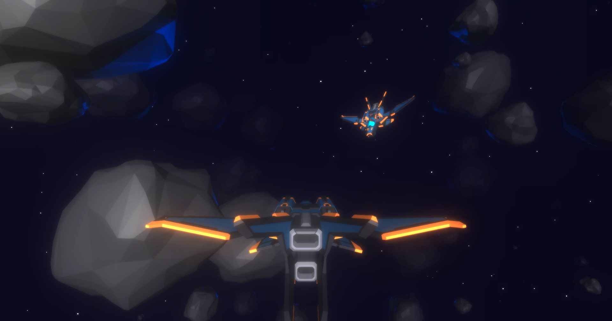

# [Voidfall](https://nickvanurk.com/voidfall)

Voidfall is a 3D multiplayer space dogfight game that runs in the browser. Jump
into an arena, chase down other pilots, and blast them out of the void. The
project doubles as a study in real-time netcode for fast-paced multiplayer
shooters.



> 🌟 If you find this project interesting, please consider giving it a star — it
> helps others discover it too!

🎮 **Play it now at [nickvanurk.com/voidfall](https://nickvanurk.com/voidfall)** —
also coming soon to [CrazyGames](https://www.crazygames.com/).

## :blush: **Why?**

I've always been fascinated by how fast-paced multiplayer games stay responsive
while every player sees a consistent world. Space shooters are the perfect
playground for that problem: fast ships, projectiles, and split-second aiming
leave nowhere to hide a laggy netcode. Voidfall started as my sandbox for
digging into that architecture, and it grew into a game I actually want to ship.

## 🧪 What's Included

- Real-time multiplayer dogfights over WebSockets
- Full 3D space flight with keyboard and mouse controls
- Weapons, projectiles, and aim assist
- Health, damage, ship destruction, and respawning
- Asteroid fields to weave through
- A HUD with a targeting reticle and on-screen indicators
- Server-authoritative worlds that scale to many concurrent players

The heart of this project is the netcode. The server owns the simulation and
broadcasts world state to every client, keeping all players in sync and cheating
in check. The ongoing focus is tightening that loop toward the responsiveness of
AAA multiplayer shooters — prediction, interpolation, and a game that still
feels good at 300ms of latency.

## :rocket: Technologies Used

- Three.js
- JavaScript
- ws (WebSockets)
- ECSY (entity-component-system)
- ammo.js (physics)
- Vite
- Node.js

## 🛠️ Installation

To run Voidfall locally, execute the following commands in your terminal:

```bash
$ git clone https://github.com/nickyvanurk/voidfall
$ cd voidfall
$ npm install
```

Then start the game server and the web client in two separate terminals:

```bash
$ npm run server:start:dev   # game server on port 1337
$ npm run client:start:dev   # web client on port 3000
```

If everything went well the game will be available at http://localhost:3000

## License

Copyright (c) 2020-2026 Nick van Urk. All Rights Reserved. This project is
proprietary — the source is public for reference only and may not be used,
copied, or distributed without written permission. See [LICENSE](./LICENSE).
